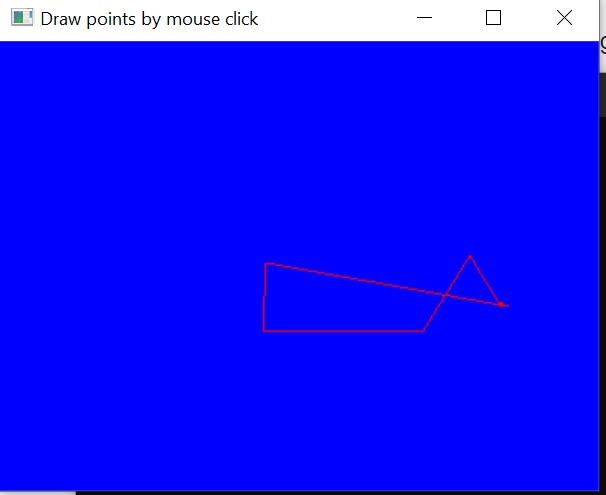
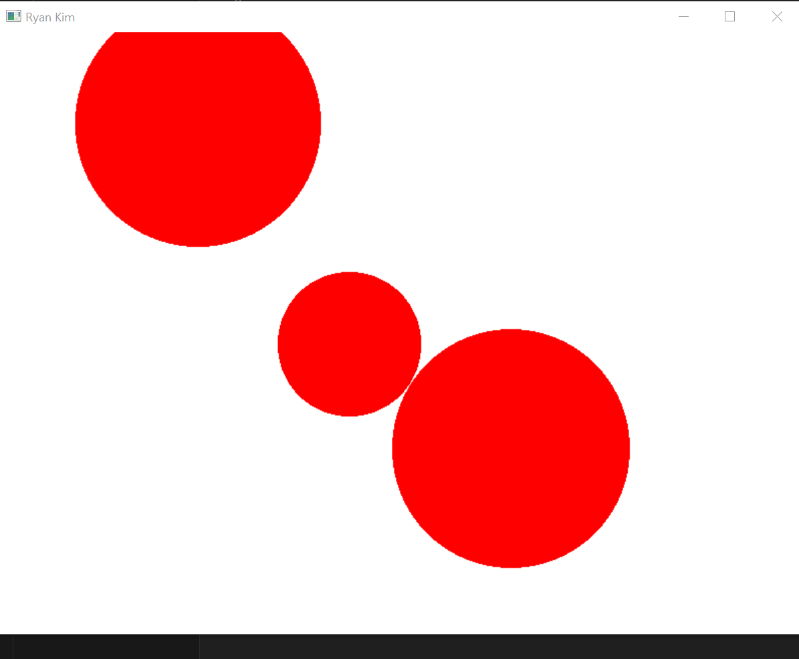
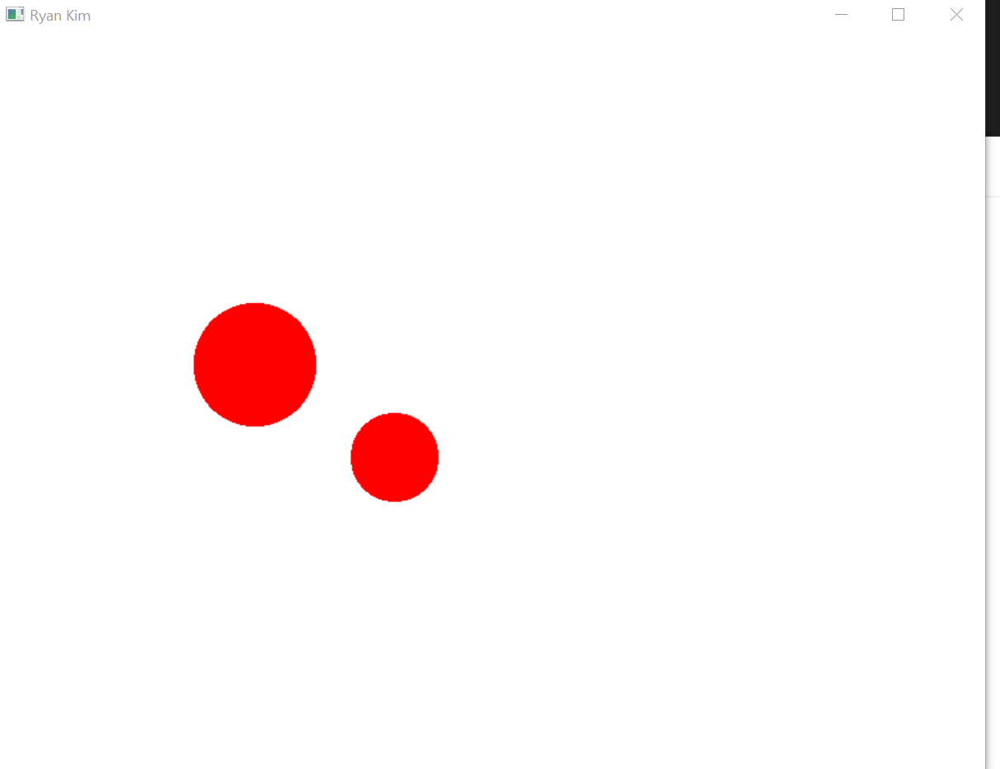
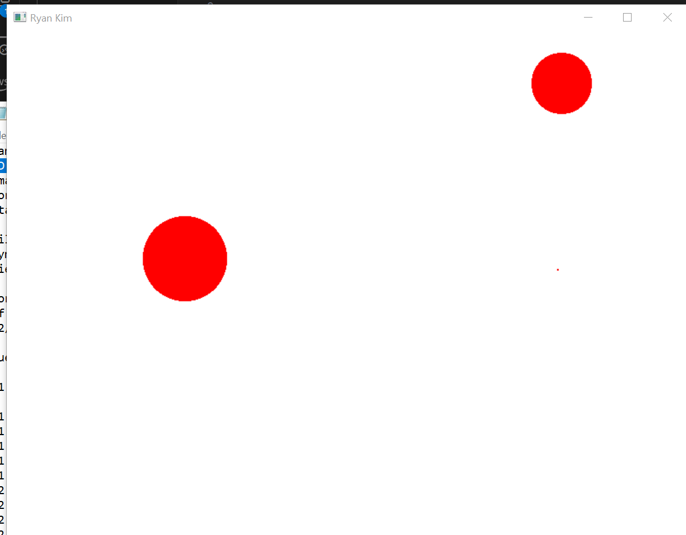
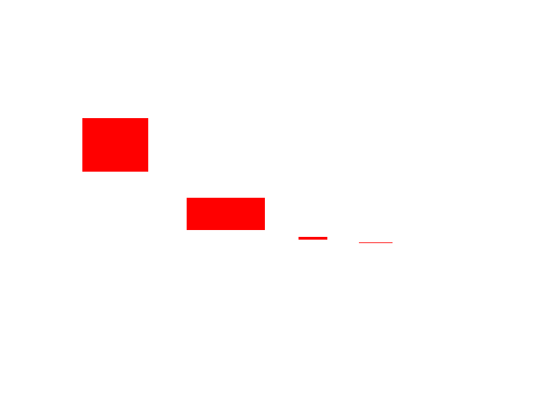

# A2 Report

Author: Ryan Kim

Date: 2023-10-03

Check [readme.txt](readme.txt) for course work statement and self-evaluation. 
  
## Q1 Graphics pipeline (description)

### Q1.1 Coordinate systems & transformations

Coodinate systems are different methods of abstracting an object's position within some virtual space. Different coordinate systems capture different representations of a scene starting with the model coordinate system which represents a model's local coordinates and then through a series of steps (Transformations) a potentially 3D coordinate system filled with models has been projected into a raster display  in the final coordinate system known as screen coordinate system or device coordinate system. The graphics pipe line from start to finish in terms of coordinate systems: Model coordinate system ->  World coordinate system -> Viewer coordinate system -> Normalized Device coordinate system -> Device coordinate system / Screen coordinate system. And the transformations to achieve these changes  coordinate systems are Modeling transformations (MCS -> WCS), Viewing transformations (WCS -> VCS), Project transforms (VCS -> NDCS), Display transformations (NDCS -> DCS).

### Q1.2 Primitives

Elements from which a model is contructed. Primitives include lines, points, polgyons, etc.
Computations for primitives are supported directly on the hardware.

Extended primitives such as a piecewise polynomial curve (spline), or implicit surfaces (quadrics, bobbies, etc) can also be supported on hardware if they are more commonly used.

### Q1.3 Scan conversion

Also known as rasterization.

The process of computing the pixels to set within a buffer frame given 2D primitives during the last step of the graphics pipeline.
Scan conversion can by implimented on either hardware (via GPU) or software (via CPU or GPGPU).

### Q1.4 Hand-on Bresenham algorithm

| k | x_k | y_k | p_k |
|---|-----|-----|-----|
| 0 | 1   | 2   | 2   |
| 1 | 2   | 3   | -2  |
| 2 | 3   | 3   | 6   |
| 3 | 4   | 4   | 2   |
| 4 | 5   | 5   | -2  |
| 5 | 6   | 5   | 6   |
| 6 | 7   | 6   | 2   |

## Q2 OpenGL and Glut (lab practice)

### Q2.1 OpenGL primitives 

Complete? Yes or No 

If you answer Yes, insert a screen shot image to show the completion.

{width=90%}

If No,  add a short description to describe the issues encountered.

### Q2.2 Interactive graphics 

Complete? Yes or No 

If you answer Yes, insert a screen shot image to show the completion.

{width=90%}

If No,  add a short description to describe the issues encountered.

### Q2.3 Bitmap file I/O 

Complete? Yes or No 

If you answer Yes, insert a screen shot image to show the completion.

{width=90%}

If No,  add a short description to describe the issues encountered.

## Q3 SimpleDraw (programming)

### Q3.1 Display window and menu

Complete? Yes or No 

If you answer Yes, insert a screen shot image to show the completion.

{width=90%}

If No,  add a short description to describe the issues encountered.

### Q3.2 Data structures

Complete? Yes or No 

If you answer Yes, insert a screen shot image to show the completion.

{width=90%}

If No,  add a short description to describe the issues encountered.

### Q3.3 Draw rectangles

Complete? Yes or No 

If you answer Yes, insert a screen shot image to show the completion.

{width=90%}

If No,  add a short description to describe the issues encountered.

### Q3.4 Draw circles

Complete? Yes or No 

If you answer Yes, insert a screen shot image to show the completion.

{width=90%}

If No,  add a short description to describe the issues encountered.

### Q3.5 Edit features

Complete? Yes or No 

If you answer Yes, insert a screen shot image to show the completion.

{width=90%}
{width=90%}

If No,  add a short description to describe the issues encountered.

### Q3.6 Save/Open SVG files

Yes

If you answer Yes, link the image
.

### Q3.7 Export to bitmap

Complete? Yes or No

If you answer Yes, link the image
.

### Q3.8 Circle&Square artwork

Complete? Yes or No

If you answer Yes, link the images
[C&S artwork in SVG](images/c&s.svg)
.

**References**

1. CP411 a2
2. Add your references if you used any. 
